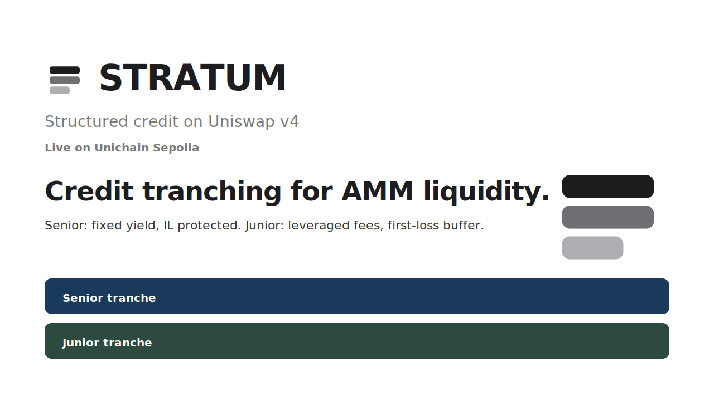
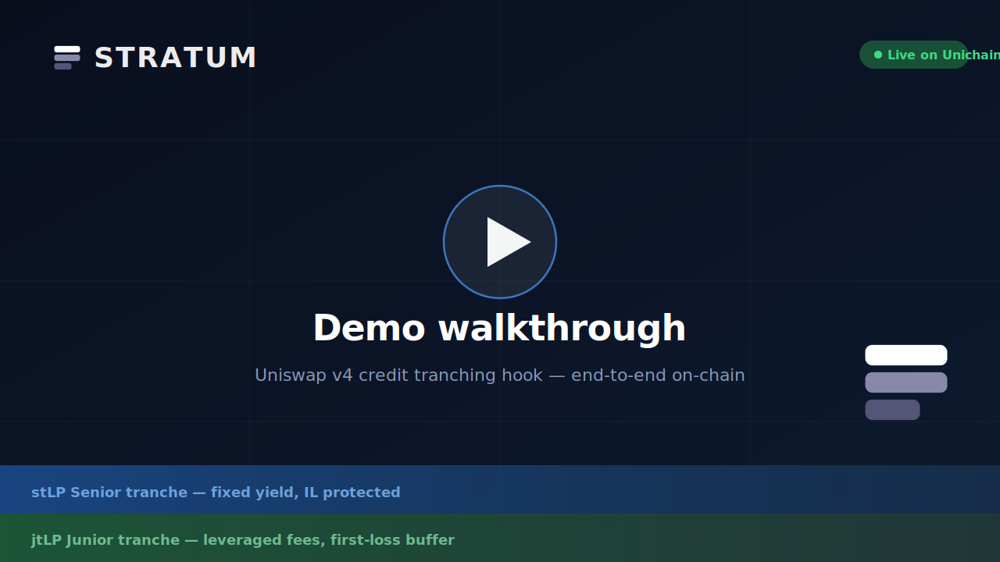
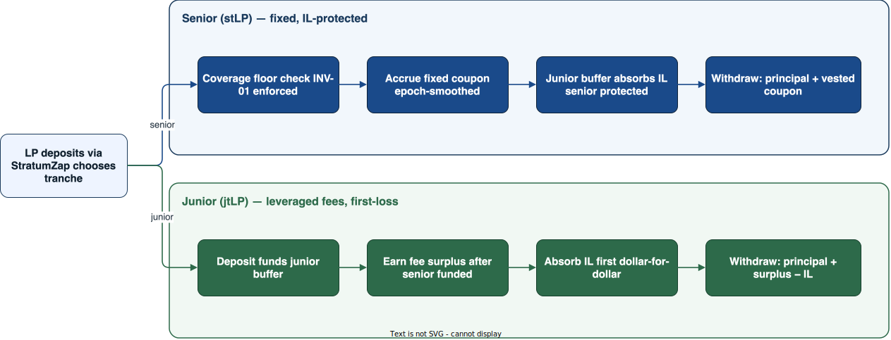
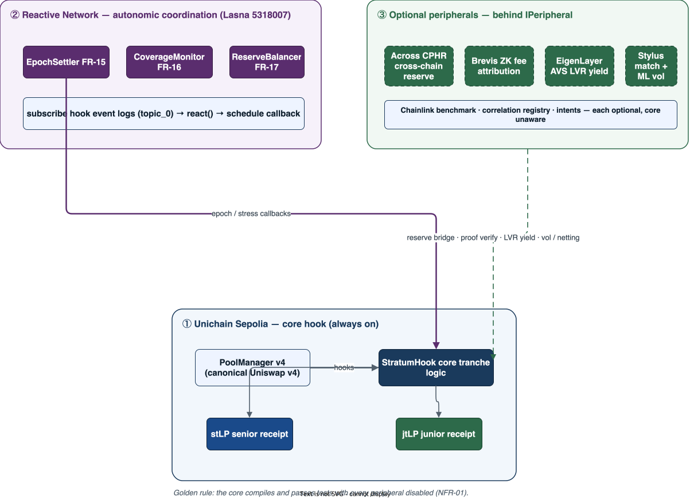
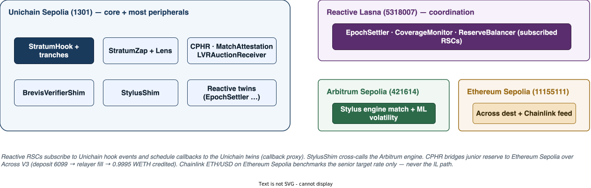
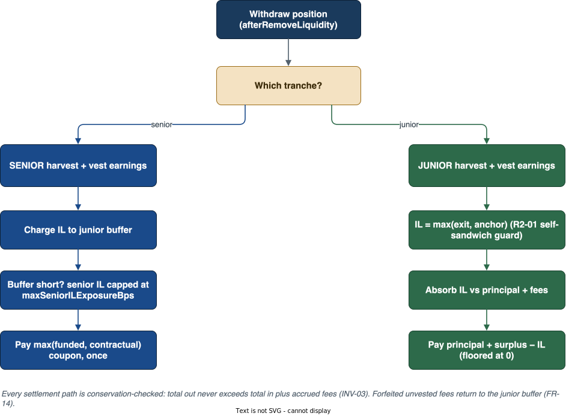
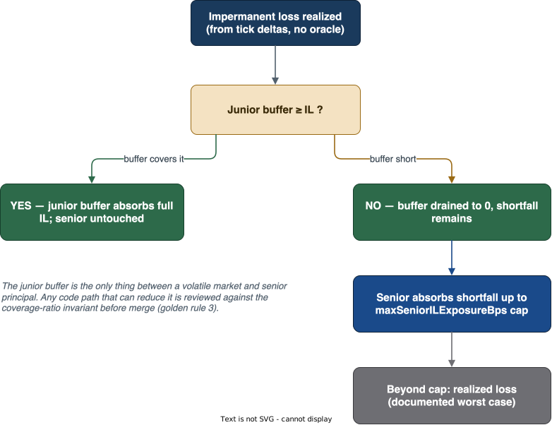
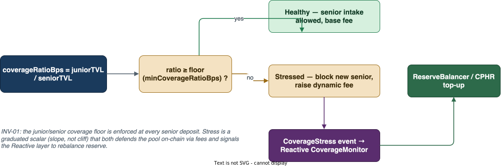

<p align="center">
  
</p>

<p align="center">
  <strong>UHI9 Project ID: HK-UHI9-0898</strong>
</p>

<p align="center">
  <a href="https://github.com/guglxni/STRATUM/actions/workflows/ci.yml"></a>
  <a href="https://soliditylang.org/"></a>
  <a href="https://book.getfoundry.sh/"></a>
  
  
  
  <a href="https://stratum-nu-dusky.vercel.app/"></a>
</p>

<p align="center">
  <a href="https://stratum-nu-dusky.vercel.app/"><strong>https://stratum-nu-dusky.vercel.app/</strong></a>
</p>

<p align="center">
  <a href="https://uniswap.org/"></a>
  &nbsp;&nbsp;
  <a href="https://reactive.network/"></a>
</p>

<p align="center">
  <strong>Structured credit subordination for Uniswap v4 liquidity.</strong><br/>
  Senior LPs earn a fixed smoothed yield, protected from impermanent loss.<br/>
  Junior LPs absorb IL first in exchange for leveraged fee exposure.<br/>
  No oracle. No underwriter. No borrowed capital.<br/>
  <br/>
  <a href="https://stratum-nu-dusky.vercel.app/"><strong>Launch live demo →</strong></a>
</p>

> 🎬 **Demo video:** [watch on Google Drive](https://drive.google.com/file/d/11uxTQE6f2XLT4vDP6GzWFl__IVvxkUyv/view?usp=drive_link) &nbsp;·&nbsp; 📺 **Product walkthrough:** [watch below](#product-walkthrough) &nbsp;·&nbsp; 🌐 **Live demo:** [stratum-nu-dusky.vercel.app](https://stratum-nu-dusky.vercel.app/)
>
> **Live addresses:** [docs/LIVE_SYSTEM.md](docs/LIVE_SYSTEM.md) &nbsp;·&nbsp; **Judge guide:** [docs/JUDGE_GUIDE.md](docs/JUDGE_GUIDE.md) &nbsp;·&nbsp; **Architecture:** [docs/ARCHITECTURE.md](docs/ARCHITECTURE.md)

The full stack is live on **Unichain Sepolia** against the canonical Uniswap v4 `PoolManager`, with Reactive RSCs on **Lasna** (chain 5318007) driving epoch settlement and coverage monitoring with no off-chain keeper, and Chainlink benchmarking the senior APY target on **Ethereum Sepolia**. Explorer evidence for every contract: [docs/LIVE_SYSTEM.md](docs/LIVE_SYSTEM.md).

---

## Demo Video

<a name="demo-video"></a>

[](https://drive.google.com/file/d/11uxTQE6f2XLT4vDP6GzWFl__IVvxkUyv/view?usp=drive_link)

**[Watch demo video on Google Drive](https://drive.google.com/file/d/11uxTQE6f2XLT4vDP6GzWFl__IVvxkUyv/view?usp=drive_link)**  
All assets also available in the [Google Drive folder](https://drive.google.com/drive/folders/1EZLK5LX6vS97P3PbWgTjU3eBeIP16l_P).

---

## Product Walkthrough

<a name="product-walkthrough"></a>

A short product tour: credit tranching, the fee waterfall, senior/junior tranches, and the live stack.

<p align="center">
  
  <br/>
  <sub>30s walkthrough</sub>
  <br/><br/>
  <a href="https://stratum-nu-dusky.vercel.app"><strong>Try the live app on Unichain Sepolia →</strong></a>
</p>

---

## The Problem

Every LP in a standard Uniswap v4 pool is structurally identical. They bear the same impermanent loss, earn the same fee yield, and have no way to express different risk appetites within the same pool. A protocol that wants to attract yield-seeking capital alongside risk-tolerant capital has no native mechanism to serve both.

This means:
- Risk-averse LPs (treasuries, structured products, institutional) stay out entirely — IL exposure is unacceptable.
- Risk-tolerant LPs (market makers, yield farmers) earn average returns with no leverage.
- Protocols cannot deepen liquidity by bridging the gap between these two LPs.

---

## The Solution: Credit Subordination on an AMM

STRATUM introduces **credit subordination** — a mechanism from structured finance — directly into the v4 hook. The pool's capital stack is split into two tranches with opposite risk/return profiles that together cover the full range of LP risk appetite:

| | **Senior tranche (stLP)** | **Junior tranche (jtLP)** |
|---|---|---|
| **Token** | `stLP` ERC-20 | `jtLP` ERC-20 |
| **Yield** | Fixed, smoothed APY (Chainlink-benchmarked) | Leveraged fee surplus after senior funded |
| **IL exposure** | Protected — junior absorbs first | Full exposure; also absorbs shortfall |
| **Position in waterfall** | First funded, last to lose | Last funded, first to lose |
| **Who it suits** | Treasuries, stable-yield LPs, risk-averse capital | Market makers, yield farmers, IL-tolerant capital |

The two tranches share a single Uniswap v4 pool and its liquidity. No token bridges, no separate vaults, no external collateral.

<p align="center">
  
</p>

---

## Prize Track Coverage

| Prize | What STRATUM delivers |
|---|---|
| **Uniswap v4 — Novel Primitive** | Credit subordination on an AMM — the first structured-credit hook. A new LP primitive that did not exist before v4 hooks. |
| **Uniswap v4 — Full Hook Theme** | Hits all five UHI9 categories in one hook: novel yield mechanism, IL management, structured product, risk layering, yield-bearing LP tokens (stLP / jtLP). |
| **Reactive Network** | Three RSCs (EpochSettler, CoverageMonitor, ReserveBalancer) subscribe to hook events on Lasna and schedule callbacks on Unichain — epoch settlement, stress monitoring, and reserve rebalancing with zero off-chain keeper. See the [dedicated section below](#reactive-network-integration-where-and-how). |
| **Unichain** | stLP and jtLP are yield-bearing ERC-20 receipt tokens deployed and live on Unichain Sepolia — exactly the kind of novel DeFi primitive the chain is designed for. |

---

## Theme Coverage: all five UHI9 "IL & Yield Systems" ideas, in one hook

The UHI9 theme asks for "yield-protected liquidity systems that shield LPs from impermanent loss while unlocking sustainable, predictable on-chain returns." The Request-for-Hooks lists five hook ideas under it. **STRATUM covers all five**, each backed by live on-chain contracts — not five separate hooks, one hook whose tranche architecture expresses all five at once.

| # | Theme idea | How STRATUM delivers it | Where in code | Live |
|---|---|---|---|---|
| 1 | **IL Insurance Hooks** | Junior subordination *is* the insurance: junior capital absorbs impermanent loss dollar-for-dollar before senior principal is ever touched; the junior buffer is funded by IL clawbacks and capped senior exposure (`maxSeniorILExposureBps`). Structural, on-chain, no premium underwriter. | `TrancheSettlementLib.sol` (`settleSenior`/`settleJunior`), `CoverageRatio.sol` | ✅ Unichain Sepolia |
| 2 | **YieldBasis-Style Fixed Income** | Senior `stLP` earns a fixed, epoch-smoothed APY paid first from the fee waterfall, optionally benchmarked against a Chainlink rate feed. This is the "predictable, sustainable return" the theme names — a fixed-income tranche on an AMM. | `EpochAccounting.sol`, `StratumRateLibrary.sol` | ✅ Chainlink read on Eth Sepolia |
| 3 | **Delta-Neutral Hooks** | **Senior delta exposure is structurally offset by junior IL absorption.** When price moves either direction, the junior tranche absorbs the position's impermanent loss, so the senior position's *settled* value is price-insensitive — senior LPs are delta-hedged without a perp, an oracle, or per-block rebalancing. An optional Stylus ML volatility model raises the dynamic fee ahead of vol spikes. This is delta-neutrality achieved by **capital subordination**, not by an external short position. | `ARCHITECTURE.md` (delta-neutral note), `TrancheSettlementLib.sol`, `StratumHook.sol` (Stylus vol hook) | ✅ Structural (live); Stylus engine live on Arbitrum Sepolia |
| 4 | **Fee-Smoothing Hooks** | Swap fees accumulate into epochs and vest linearly per-share, so yield is distributed smoothly over time instead of in lumpy per-swap cliffs. Unvested fees on early exit forfeit to the junior buffer. | `StratumHook.sol` (`closeEpoch`, `afterSwap`), `TrancheSettlementLib.sol` (`harvestAndVest`) | ✅ Unichain Sepolia |
| 5 | **Cross-Pool Hedging Routers** | A `CorrelationRegistry` models correlated pools; the `CrossPoolHedgingRouter` nets opposing IL across correlated pairs (`netExposures`), aggregates junior reserve same-chain, and bridges reserve cross-chain over Across V3 to defend a stressed pool's coverage floor. | `src/peripherals/across/` | ✅ Across full loop (deposit 6099 → 0.9995 WETH credited on Sepolia) |

**On idea #3 specifically (the one that is easy to miss):** STRATUM is delta-neutral *for the senior tranche* by construction. Most delta-neutral hooks reach neutrality by opening an offsetting position on an external venue (a perp, an option). STRATUM reaches it by **subordination** — the junior tranche is the offsetting position, held inside the same pool. That makes the senior outcome price-insensitive with no oracle in the loss path, no external venue, and no bridge dependency for the hedge itself. It is the most robust form of the idea because it cannot break when a funding rate flips, a perp venue is unreachable, or a bridge stalls.

---

## Architecture

<p align="center">
  
</p>

STRATUM is designed in concentric layers:

**Layer 1 — Core hook** (`src/StratumHook.sol`): All tranche logic, the fee waterfall, IL accounting, and settlement. Zero external dependencies. Compiles and passes all tests with every peripheral disabled (NFR-01).

**Layer 2 — Reactive coordination** (`src/peripherals/reactive/`): Three RSCs on Reactive Lasna subscribe to hook events and drive settlement callbacks back to Unichain Sepolia. No keeper, no cron job, no off-chain bot.

**Layer 3 — Optional peripherals** (behind `IPeripheral`): Chainlink APY benchmarking, Arbitrum Stylus matching engine, cross-pool hedging router, Brevis ZK proof verifier, EigenLayer LVR auction receiver. Each is an independent module the core never calls directly — it emits events that peripherals react to.

The full layer breakdown: [docs/ARCHITECTURE.md](docs/ARCHITECTURE.md).

### Where each piece runs

The full stack spans four chains. The core and most peripherals live on Unichain Sepolia; coordination runs on Reactive Lasna; Stylus compute on Arbitrum Sepolia; the Across destination and Chainlink feed on Ethereum Sepolia.

<p align="center">
  
</p>

---

## How It Works End to End

### 1. Pool initialization

At `beforeInitialize`, the deployer configures the tranche parameters: target senior APY, coverage floor (minimum `juniorTVL / seniorTVL` ratio), epoch length, IL cap, smoothing window, and fee bounds. These are stored in `PoolTrancheState` and never change after initialization — no admin keys on pool parameters.

### 2. Deposit and tranche selection

LPs call `addLiquidity` with a `tranche` flag. STRATUM mints either `stLP` or `jtLP` tokens proportional to the LP's share. The hook records the entry `sqrtPriceX96` for each position — this is the baseline for IL calculation at exit.

Before a senior deposit is accepted, the coverage ratio invariant is checked: `juniorTVL * 10000 / seniorTVL >= minCoverageRatioBps`. If the junior buffer is too thin, the senior deposit reverts. This prevents senior exposure that cannot be backstopped.

### 3. Fee waterfall on every swap

<p align="center">
  
</p>

Every swap triggers a dynamic fee calculation:

```
fee = clamp(baseFeeBps + volatilityBump + stressBump, minFeeBps, maxFeeBps)
```

The fee is then split by `Waterfall.splitFee`:
- Senior portion is credited toward the epoch's senior obligation.
- Junior portion accrues to `juniorFeePerShareX128`.

If the coverage ratio is stressed (junior buffer thin), `stressBump` increases the fee, generating more income to restore the buffer.

### 4. Epoch settlement (triggered by Reactive)

At the end of each epoch, `EpochSettler` (Reactive RSC) calls `stratumHook.closeEpoch(poolId)` via callback. The settlement logic:

1. Sum accumulated fees against the senior obligation for the epoch.
2. If fees are short: draw the shortfall from `juniorReserve`.
3. If fees exceed the obligation: credit the surplus to `juniorFeePerShareX128`.
4. Advance the epoch counter (INV-06: epoch counter never decreases).

Earnings vest linearly over `smoothingEpochSeconds`. At exit, only the vested fraction is paid out — the unvested remainder is forfeited to `juniorReserve`, strengthening the buffer (FR-14).

### 5. Withdrawal and IL settlement

On `afterRemoveLiquidity`, IL is computed from the tick delta since entry using only pool state (no oracle):

```
held(P_exit)    = amount0_entry × P_exit + amount1_entry   (hold-to-exit value)
lpValue(P_exit) = value of LP position at P_exit
IL              = max(0, held − lpValue)
```

**Junior exit:** IL is charged directly. `payout = principal + vestedFees − IL`. If IL exceeds the position, payout is zero — junior cannot go negative.

**Senior exit:** `juniorReserve -= ilOnPosition` absorbs IL first. If the buffer is fully depleted, the remaining shortfall is absorbed by senior principal, capped at `maxSeniorILExposureBps`. If the pool returned less than the protected payout, the token-backed reserve (`reserve0`/`reserve1`) tops up the senior LP in real tokens — the protection is paid in-kind, not in a synthetic.

<p align="center">
  
</p>

The junior buffer is the only thing between a volatile market and senior principal. The IL absorption order is strict:

<p align="center">
  
</p>

---

## Reactive Network Integration (where and how)

STRATUM uses Reactive Smart Contracts (RSCs) to drive settlement and risk response **with no off-chain keeper**. The core hook emits ordinary EVM events; the RSCs subscribe on the Reactive chain and schedule callbacks back to the origin chain.

<p align="center">
  
</p>

### Where in the code

All three RSCs live in [`src/peripherals/reactive/`](src/peripherals/reactive/):

| RSC | File | Subscribes to | Effect on origin chain |
|-----|------|---------------|------------------------|
| **EpochSettler** | [`EpochSettler.sol`](src/peripherals/reactive/EpochSettler.sol) | `EpochClosed(bytes32,uint64,uint256,uint256)` | Calls `stratumHook.closeEpoch(poolId)` — runs the fee waterfall and advances the epoch |
| **CoverageMonitor** | [`CoverageMonitor.sol`](src/peripherals/reactive/CoverageMonitor.sol) | `CoverageStress(bytes32,uint16,uint16)` | Broadcasts a coverage-stress signal so off-chain dashboards and Reactive-aware integrations can react |
| **ReserveBalancer** | [`ReserveBalancer.sol`](src/peripherals/reactive/ReserveBalancer.sol) | `JuniorReserveUpdated(bytes32,uint64,uint256)` | Requests a CPHR rebalance when a pool's junior reserve diverges from the cross-pool average |

Shared Reactive plumbing: [`AbstractReactive.sol`](src/peripherals/reactive/AbstractReactive.sol), [`IReactive.sol`](src/peripherals/reactive/IReactive.sol), [`ISystemContract.sol`](src/peripherals/reactive/ISystemContract.sol).

### How it works (three steps)

1. **Subscribe (constructor).** Each RSC subscribes to one concrete `topic_0` via the Reactive system contract at deploy time. On a plain EVM the subscribe call is a no-op — the core still builds and tests with Reactive absent (NFR-01).
2. **React (`react(LogRecord)`).** When the hook emits a subscribed event, the Reactive Network delivers the log to the RSC's `react` entrypoint on Lasna chain. `react` decodes `poolId` from `topic_1` and emits a `Callback` event scheduling `reactiveCallback(poolId)` on the origin chain.
3. **Callback (`reactiveCallback`).** The Reactive callback proxy executes the scheduled call on Unichain Sepolia — no keeper, no cron. Each RSC also exposes an operator-gated fallback (`settleEpoch` / `reportCoverage`) for deterministic Foundry and demo runs.

Since the Reactive **Omni fork** (2026-05-25) there is one unified environment — no ReactVM split. Subscriptions and callbacks are backward-compatible.

### Live deployment

RSCs on **Reactive Lasna** (chain 5318007), callback twins on **Unichain Sepolia**:

| Contract | Reactive Lasna | Unichain twin |
|----------|----------------|---------------|
| EpochSettler | `0xB675…58E2` | `0x57E9…C2b8` |
| CoverageMonitor | `0x54E0…87B3` | `0x32bD…e49f` |
| ReserveBalancer | `0x43084…4c95` | `0xdD7F…9F79` |
| Callback proxy (Unichain) | — | `0x9299…7FC4` |

Full addresses and explorer links: [docs/LIVE_SYSTEM.md](docs/LIVE_SYSTEM.md). The demo UI's **Reactive lab** (`/#labs`) walks these four steps with live contract links.

---

## Key Invariants

These six invariants are enforced in every code path and fuzz-tested in `test/invariant/StratumInvariants.t.sol`:

| ID | Rule | Enforced at |
|---|---|---|
| INV-01 | Coverage floor: `juniorTVL × 10000 / seniorTVL >= minCoverageRatioBps` | Every senior deposit |
| INV-02 | Senior IL cap: senior principal reduced only after junior buffer depleted, capped at `maxSeniorILExposureBps` | Every senior withdrawal |
| INV-03 | Conservation: `totalOut <= totalIn + fees + ROUNDING_TOLERANCE (100 wei)` | Every settlement path |
| INV-04 | Waterfall priority: junior surplus is non-zero only after the senior obligation is fully funded | `closeEpoch` |
| INV-05 | Buffer monotonicity: `juniorReserve` credited only by fee surplus and fee forfeiture; debited only by IL absorption | Every reserve mutation |
| INV-06 | Epoch monotonicity: epoch counter never decreases | `closeEpoch` |

The coverage floor (INV-01) is the load-bearing guard. It is graduated — a slope, not a cliff — defending the pool on-chain through dynamic fees and signaling the Reactive layer to rebalance reserve before the floor is breached:

<p align="center">
  
</p>

---

## Quick Start

### Prerequisites

- [Foundry](https://getfoundry.sh/) (forge, cast, anvil) — for the contracts
- Node.js 18+ with npm — for the frontend

### Build and test

```bash
# Clone with submodules (v4-periphery, v4-core)
git clone --recurse-submodules https://github.com/guglxni/STRATUM.git
cd STRATUM

# Build all Solidity (core + peripherals + libraries)
forge build

# Run the full test suite (unit + integration + invariant)
forge test --no-match-path "test/fork/*"

# Run the stress scenario (12 tests, verifies INV-01..03 under volatile price path)
forge test --match-path "test/scenario/Stress.t.sol" -v

# Run invariant fuzz tests (INV-01..INV-06 with 1000 runs each)
forge test --match-path "test/invariant/*"

# Run a single suite
forge test --match-path "test/integration/StratumHook.t.sol" -v
```

All 265+ tests pass with `forge test`. No fork tests are required to pass the core suite.

### Deploy to Unichain Sepolia

```bash
# 1. Copy and fill the environment file
cp .env.example .env
# Required: PRIVATE_KEY, UNICHAIN_SEPOLIA_RPC
# Optional: CHAINLINK_ETH_USD_FEED (defaults to Sepolia address in EnvConfig.sol)

# 2. Deploy core hook + all peripherals
forge script script/DeployStratum.s.sol \
  --rpc-url $UNICHAIN_SEPOLIA_RPC \
  --broadcast \
  --slow \
  --delay 1

# 3. Initialize a WETH/USDC tranche pool
forge script script/InitStratumPool.s.sol \
  --rpc-url $UNICHAIN_SEPOLIA_RPC \
  --broadcast

# 4. Wire Reactive RSCs (deploys EpochSettler, CoverageMonitor, ReserveBalancer)
forge script script/DeployReactive.s.sol \
  --rpc-url $REACTIVE_LASNA_RPC \
  --broadcast
```

### Run the demo frontend

```bash
cd frontend
npm install

# Point at your deployed hook (or use the live testnet addresses from docs/LIVE_SYSTEM.md)
export NEXT_PUBLIC_HOOK_ADDRESS=0x...
export NEXT_PUBLIC_RPC_URL=https://sepolia.unichain.org

npm run dev
# Open http://localhost:5173
```

The frontend includes per-integration "feature labs" at `/#labs` — live reads from the hook, Reactive RSCs, Chainlink feeds, and EigenLayer attestation contract on their respective testnets.

---

## Repository Layout

```
src/
  StratumHook.sol               Core hook: tranche logic, waterfall, settlement
  TrancheToken.sol              stLP and jtLP ERC-20 receipt tokens
  StratumTypes.sol              Shared structs (PoolTrancheState, TranchePosition)
  StratumErrors.sol             Custom errors — no revert strings (gas-efficient)
  base/StratumBaseHook.sol      BaseHook wrapper (v4-periphery)
  libraries/
    ILMath.sol                  IL from tick deltas — pure math, no oracle
    Waterfall.sol               Senior-first fee split and dynamic fee computation
    CoverageRatio.sol           Coverage floor enforcement and stress scalar
    EpochAccounting.sol         Epoch accumulator, obligation, linear vesting
    ReserveMath.sol             Per-currency clamped payout math
    StratumRateLibrary.sol      Chainlink-benchmarked senior APY target (FR-25)
    TrancheSettlementLib.sol    Settlement extracted for EIP-170 compliance
    PoolInitLib.sol             Pool init parameter validation
  interfaces/
    IStratumHook.sol            External API surface — called by peripherals and scripts
    IPeripheral.sol             Common interface all optional modules implement
  peripherals/
    reactive/                   EpochSettler, CoverageMonitor, ReserveBalancer RSCs
    across/                     CorrelationRegistry, CrossPoolHedgingRouter (CPHR)
    brevis/                     BrevisVerifierShim — ZK TW-contribution proofs
    eigenlayer/                 LVRAuctionReceiver, MatchAttestation AVS shim
    stylus/                     StylusShim — calls Arbitrum Stylus matching engine

test/
  scenario/Stress.t.sol         12-test stress scenario (PRD C2): price moves, IL, waterfall
  integration/StratumHook.t.sol Core lifecycle: deposit, swap, settle, withdraw
  integration/Peripheral.t.sol  Reactive peripheral wiring and callback simulation
  integration/EigenLayer.t.sol  MatchAttestation quorum, attestation gating (FR-24)
  integration/Brevis.t.sol      BrevisVerifierShim proof submission (FR-21, FR-22)
  invariant/StratumInvariants.t.sol Fuzz: INV-01..INV-06, 1000 runs each
  unit/                         CoverageRatio, ILMath, Waterfall, EpochAccounting
  utils/StratumFlags.sol        Test helpers and flag constants

script/
  DeployStratum.s.sol           Full deployment: core + all peripherals
  DeployReactive.s.sol          Deploy and wire Reactive RSCs to Lasna
  InitStratumPool.s.sol         Initialize a WETH/USDC pool with tranche params
  InitSepoliaWethPool.s.sol     Sepolia-specific pool init
  DemoLifecycle.s.sol           Scripted end-to-end demo (deposit → swap → settle)
  CanonicalAddresses.sol        Uniswap v4 canonical addresses per chain
  EnvConfig.sol                 PRIVATE_KEY and RPC helpers

frontend/
  src/App.tsx                   Root app (wagmi/viem, hash routing)
  src/Landing.tsx               Marketing landing page
  src/components/labs/          Feature labs: Hook, Reactive, Chainlink, EigenLayer, Across, Brevis
  src/config/addresses.ts       Deployment addresses — all testnets
  src/lib/attestedMatches.ts    Blockscout log fetch for EigenLayer matchHashes

operator/                       Rust: EigenLayer AVS operator node (match attestation signing)
stylus/                         Rust: Arbitrum Stylus matching engine + ML volatility model
brevis/                         Go: Brevis proof request tooling
brevis-circuits/                Go + gnark: ZK circuits for TW-contribution proofs
subgraph/                       The Graph subgraph (epoch, swap, coverage event history)
docs/                           Public docs, PRD, architecture, live system, judge guide, diagrams
```

---

## Core Design

### Fee Waterfall

<p align="center">
  
</p>

Every swap generates a fee. The waterfall processes it in three stages:

1. **Dynamic fee computation.** `clamp(baseFeeBps + volBump + stressBump, minFeeBps, maxFeeBps)`. The `stressBump` increases fee income when the coverage ratio is under pressure, accelerating buffer restoration.
2. **Senior-first split.** `Waterfall.splitFee` divides the fee: the senior fraction funds the epoch obligation; the junior fraction accrues to `juniorFeePerShareX128`.
3. **Epoch close.** `closeEpoch` reconciles accumulated fees against the obligation. Shortfall drawn from `juniorReserve`; surplus credited to junior fee-per-share. The epoch counter advances (INV-06).

### IL Accounting (oracle-free)

IL is computed from pool `sqrtPriceX96` alone — no price feed, no oracle. For a concentrated position `[tickLower, tickUpper]`:

```
held(P_exit)    = amount0_entry × P_exit + amount1_entry   (value if tokens held to exit)
lpValue(P_exit) = reconstructed LP position value at P_exit
IL              = max(0, held − lpValue)
```

All arithmetic is Q64.96 fixed-point via `FullMath.mulDiv` and `ILMath.sol`. The absence of an oracle is a security property: no price manipulation can affect IL accounting.

### Senior Protection Mechanism

The senior protection has three layers, applied in order on withdrawal:

1. **Junior buffer:** `juniorReserve` absorbs IL up to the buffer balance.
2. **IL cap:** if the buffer is depleted, the remaining IL is applied to senior principal, but capped at `maxSeniorILExposureBps` of the position size.
3. **Token-backed reserve:** if the pool returned fewer tokens than the protected payout, `reserve0`/`reserve1` top up the senior LP in-kind.

This layering means senior protection is both real (backed by actual reserves) and bounded (the cap prevents unlimited senior loss if junior is completely wiped).

### Epoch Vesting and Smoothing (FR-07, FR-14)

Yield is not paid out immediately on close. Earnings vest linearly over `smoothingEpochSeconds`. At withdrawal, only the vested fraction is paid. The unvested remainder is forfeited to `juniorReserve`. This:
- Prevents senior LPs from exit-arbitraging a high-yield epoch.
- Continuously strengthens the junior buffer, improving coverage ratios over time.
- Smooths the effective senior APY across volatile and quiet epochs alike.

---

## Security Notes

- **No oracle in IL math.** `ILMath.ilForRange` uses only pool `sqrtPriceX96`. Chainlink is an optional input to the senior APY *target* only — never to IL accounting or settlement.
- **Peripheral isolation.** No peripheral can revert a settlement: all peripheral calls are wrapped in `try/catch` with a 150,000 gas stipend. A failing RSC cannot block an LP withdrawal.
- **Conservation enforced.** Every settlement path checks `totalOut <= totalIn + fees + 100 wei`. If violated, the transaction reverts with `ConservationViolation` (INV-03). The 100 wei tolerance covers Q64.96 rounding.
- **Checked arithmetic.** Solidity 0.8.26 reverts on overflow by default. `FullMath.mulDiv` handles intermediate Q64.96 multiplication without overflow risk.
- **No admin keys on pool parameters.** All tranche parameters are set at `beforeInitialize` and immutable after. There is no `setTargetAPY` or similar post-init admin function.
- **Core is always self-contained.** `forge test` passes with zero peripherals enabled (NFR-01). The core cannot be bricked by a peripheral being unavailable.

---

## PRD Success Criteria

| ID | Criterion | Evidence |
|---|---|---|
| C1 | Core deploys to Unichain Sepolia; full deposit-swap-settle cycle | `DeployStratum.s.sol` + [LIVE_SYSTEM.md](docs/LIVE_SYSTEM.md) |
| C2 | Stress scenario: senior made whole, junior absorbing IL | `test/scenario/Stress.t.sol` — 12 tests, all passing |
| C3 | Reactive RSCs drive epoch settlement and coverage monitoring live | EpochSettler, CoverageMonitor, ReserveBalancer deployed on Lasna |
| C4 | CPHR demonstrates cross-pool reserve rebalance | `CrossPoolHedgingRouter` + `CorrelationRegistry` |
| C5 | At least one Brevis proof path verifies TW-contribution per epoch | `BrevisVerifierShim.submitTWContributionProof` (FR-21) |
| C6 | Submission reads as a structured-credit primitive | Opening paragraph of this README |

---

## Contributing

See [CONTRIBUTING.md](CONTRIBUTING.md) for contribution guidelines, branch naming, and the PR checklist.

Security issues: see [SECURITY.md](SECURITY.md) for the responsible disclosure process.

---

## License

MIT — see [LICENSE](LICENSE).
