# STRATUM Architecture

Status: design baseline for UHI9 build. Authoritative for system structure. For exact contract behavior see `TECHNICAL_DESIGN.md`. For requirements see `REQUIREMENTS.md`.

## 1. Thesis

Liquidity providers face a single combined risk (swap-fee income net of impermanent loss) and have no way to separate the two. STRATUM splits that combined position into two risk classes and lets the market price the split:

- Senior tranche: fixed, smoothed yield with impermanent loss protection. Bond-like.
- Junior tranche: leveraged exposure to swap fees, absorbs impermanent loss first. Equity-like.

This is the priority-waterfall and subordination structure used in TradFi structured credit, applied to AMM liquidity for the first time. The junior tranche is the underwriter. The fee split is the leverage. Nothing external is required for the core to function.

## 2. System layers

STRATUM is organized as a core plus optional peripherals. The core is self-sufficient. Peripherals add capability and are coordinated by an autonomic layer.

### Diagrams (Mermaid + draw.io)

Full catalog and render instructions: [diagrams/README.md](diagrams/README.md). Regenerate SVG + PNG:

```bash
brew install --cask drawio   # if needed
./scripts/render-diagrams.sh
```

#### Architecture & integrations

| View | Source | SVG |
|------|--------|-----|
| System layers | [system-layers.mmd](diagrams/mermaid/system-layers.mmd) |  |
| Prize-track canvas (editable) | [stratum-system.drawio](diagrams/drawio/stratum-system.drawio) | 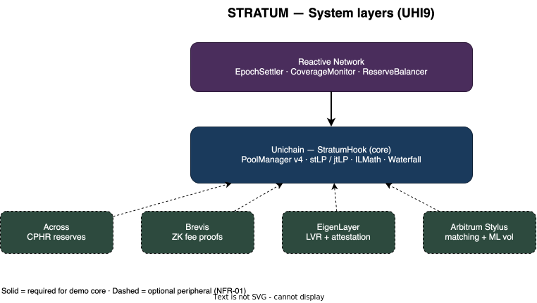 |
| Tranche economics | [tranche-economics.mmd](diagrams/mermaid/tranche-economics.mmd) |  |
| Testnet deploy | [deploy-testnet.mmd](diagrams/mermaid/deploy-testnet.mmd) | 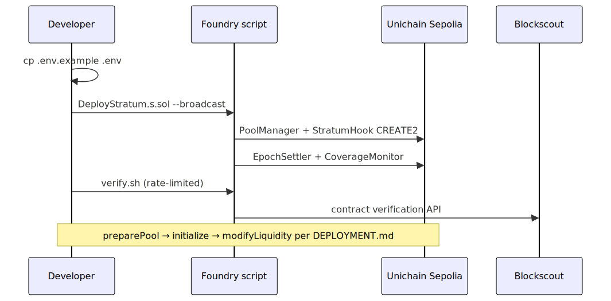 |

#### Hook & contracts

| View | Source | SVG |
|------|--------|-----|
| Callback sequence | [hook-lifecycle.mmd](diagrams/mermaid/hook-lifecycle.mmd) | 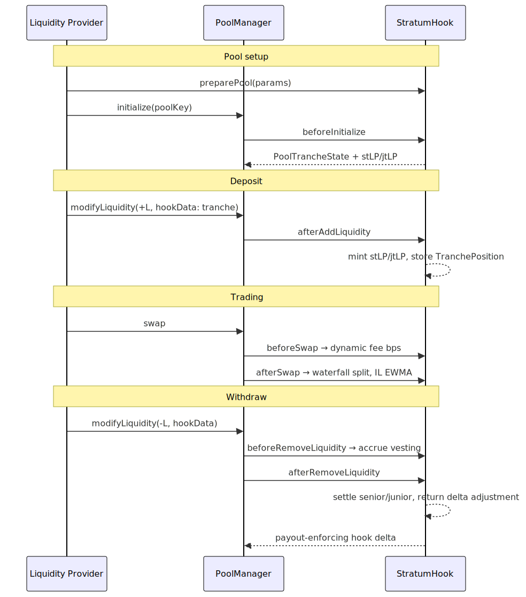 |
| Hook internals | [stratum-hook-internals.drawio](diagrams/drawio/stratum-hook-internals.drawio) | 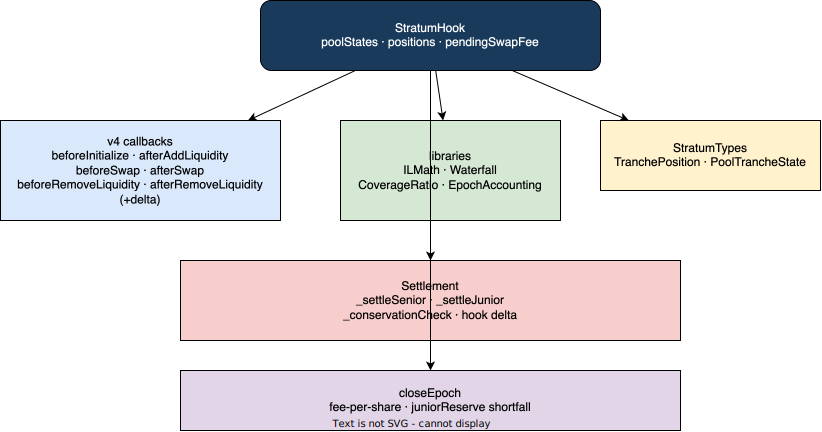 |
| Deposit flow | [deposit-flow.mmd](diagrams/mermaid/deposit-flow.mmd) |  |
| Data model | [data-model.mmd](diagrams/mermaid/data-model.mmd) |  |
| Repo modules | [repo-map.mmd](diagrams/mermaid/repo-map.mmd) |  |

#### Fees, epochs, coverage

| View | Source | SVG |
|------|--------|-----|
| Fee → epoch → tranches | [fee-waterfall.mmd](diagrams/mermaid/fee-waterfall.mmd) |  |
| Waterfall split weights | [waterfall-split.mmd](diagrams/mermaid/waterfall-split.mmd) | 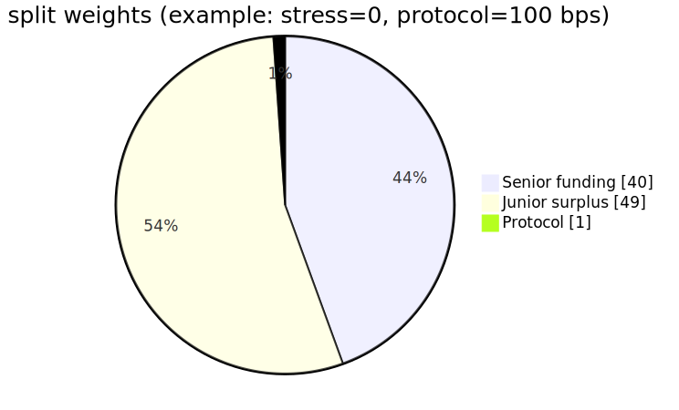 |
| Priority waterfall (editable) | [tranche-waterfall.drawio](diagrams/drawio/tranche-waterfall.drawio) | 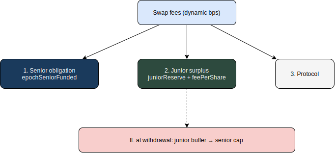 |
| Epoch lifecycle | [epoch-lifecycle.mmd](diagrams/mermaid/epoch-lifecycle.mmd) |  |
| Coverage & epoch control | [coverage-ratio.mmd](diagrams/mermaid/coverage-ratio.mmd) |  |
| Coverage + reserve | [coverage-epoch.drawio](diagrams/drawio/coverage-epoch.drawio) | 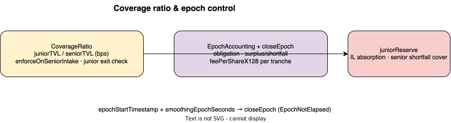 |

#### Settlement & assurance

| View | Source | SVG |
|------|--------|-----|
| Withdrawal settlement | [settlement-flow.mmd](diagrams/mermaid/settlement-flow.mmd) |  |
| Invariants mind map | [invariants.mmd](diagrams/mermaid/invariants.mmd) |  |

PNG exports for slides live in `diagrams/png/` (same basenames).

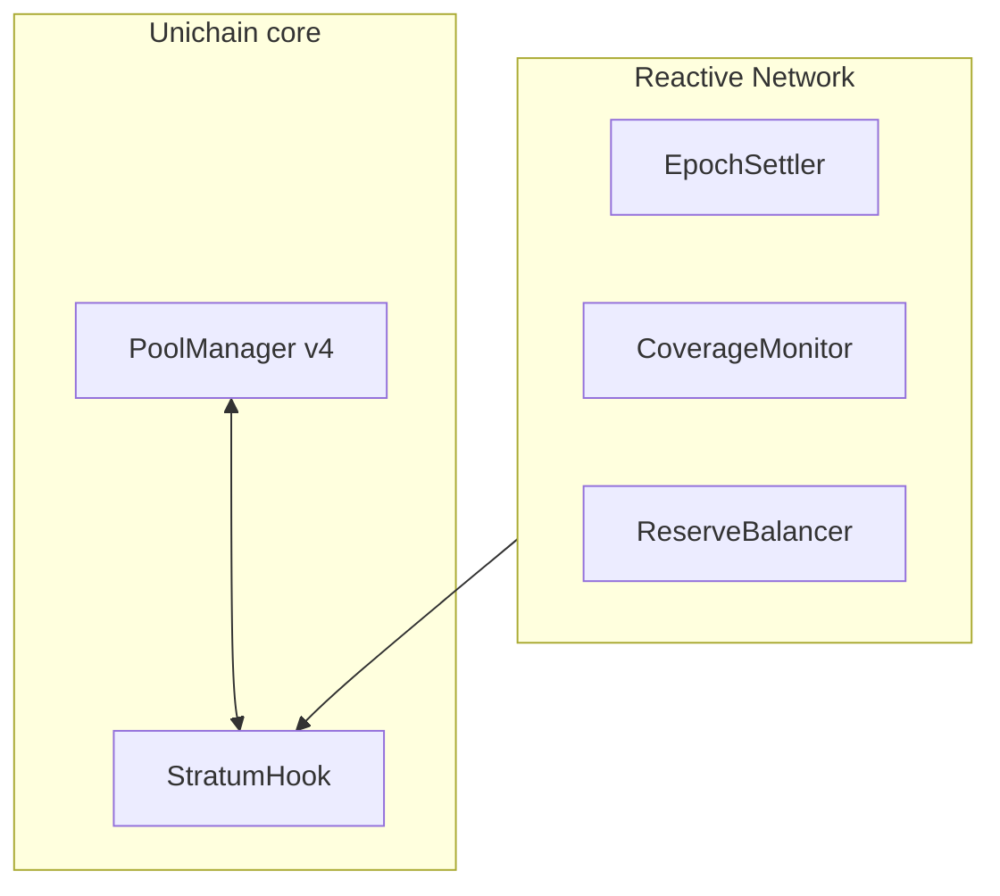

Reactive sits at the center as connective tissue. Each peripheral is a specialized execution environment that Reactive activates in response to on-chain events. This removes the need for off-chain keeper infrastructure.

**Code structure map:** [CODEBASE_GRAPH.md](CODEBASE_GRAPH.md) (graphify analysis of `src/`).

## 3. Core: the StratumHook

The hook lives on the EVM (Unichain) and uses the following v4 callbacks. Exact logic is in `TECHNICAL_DESIGN.md`.

- `beforeInitialize`: write pool parameters into `PoolTrancheState` (senior target APY in bps, coverage ratio floor, epoch length, max senior IL exposure, peripheral addresses if any).
- `afterAddLiquidity`: register the LP's tranche choice, snapshot entry `sqrtPriceX96` and tick range, enforce the coverage ratio floor, mint `stLP` or `jtLP`.
- `beforeSwap`: return a dynamic fee. Fee rises with trailing volatility (EWMA of price movement) and falls when the junior buffer is healthy and volatility is low.
- `afterSwap`: split the fee into senior obligation, junior surplus, and protocol fee; accumulate into the current epoch; update per-position IL tracking from the tick delta; emit telemetry events for Reactive and the frontend.
- `beforeRemoveLiquidity`: if an epoch boundary has been crossed since the position's last settlement, request a Brevis proof of time-weighted contribution (optional path; falls back to on-chain approximate accounting if Brevis is disabled).
- `afterRemoveLiquidity`: settle. Senior receives principal plus accrued fixed yield, made whole on IL up to the configured cap because the junior buffer absorbed it. Junior receives excess fees earned minus IL absorbed.

Core libraries: `ILMath` (IL from tick deltas), `Waterfall` (senior-first distribution), `CoverageRatio` (floor enforcement and self-balancing), `EpochAccounting` (accumulator and linear smoothing).

## 4. The five UHI9 categories, one system

| UHI9 category | STRATUM mechanism |
|---------------|-------------------|
| IL Insurance | Junior subordination and priority waterfall in settlement |
| YieldBasis / Pendle-style Fixed Income | Senior tranche fixed APY, paid first from the epoch accumulator |
| Delta-Neutral | Senior delta exposure is structurally offset by junior IL absorption |
| Fee-Smoothing | Epoch accumulator distributes fees on a linear vesting schedule |
| Cross-Pool Hedging Routers | CPHR aggregates junior reserves across correlated pools and chains |

## 5. Reactive Network: the autonomic layer

Three Reactive Smart Contracts plus a set of cross-component routers. Reactive watches on-chain events and fires callbacks, so STRATUM needs no bots.

- EpochSettler: at each epoch boundary, triggers settlement and distributes senior obligations and junior surplus.
- CoverageMonitor: listens to liquidity events; when the aggregate junior/senior ratio approaches the floor, broadcasts a stress signal that the hook reads to tighten senior intake and raise dynamic fees.
- ReserveBalancer: listens to junior reserve balances across chains; when a local reserve diverges from the cross-chain average beyond a threshold, triggers a rebalance through the CPHR.

Reactive also drives the peripheral routers: it triggers Stylus compute on meaningful pool-state changes, requests Brevis proofs at epoch boundaries, requests EigenLayer attestations when an LVR auction needs to clear, and initiates Across bridges when reserves cross thresholds. This central-coordinator role is the canonical demonstration of what Reactive enables and is the basis of the Reactive prize submission.

## 6. Across: the Cross-Pool Hedging Router (CPHR)

Junior tranches of correlated pools share a unified reserve surface rather than sitting in isolated silos.

- Reserve aggregation: a depleted junior reserve in pool A is topped up from a healthy reserve in correlated pool B on the same chain.
- Cross-chain reserve sharing: when one chain's reserve is breached (for example a flash crash), Across bridges reserve capital from chains where the same pair's junior reserve is healthy.
- Cross-pool IL netting: opposing junior exposures across correlated pairs are netted to reduce aggregate IL while preserving each LP's individual yield stream.

Correlations are defined in a `CorrelationRegistry`. The matching that selects netting and rebalancing opportunities runs on Stylus (section 8) because it is compute-heavy.

## 7. Brevis: verifiable fee distribution

When LPs enter and exit mid-epoch, fair distribution of junior surplus and accurate IL attribution require time-weighted accounting. Doing this on-chain for every position is expensive and approximate. Brevis generates a ZK proof over historical pool data that proves:

- Time-weighted junior contribution to each epoch's surplus.
- Per-position IL absorption over the actual holding period.
- Aggregate cross-chain junior reserve solvency without exposing individual positions.

The hook verifies the proof at settlement. If Brevis is disabled, the core falls back to on-chain approximate accounting, preserving the golden rule that the core works standalone.

## 8. Arbitrum Stylus: the compute layer (Rust)

The CPHR matching engine is the compute-heavy part of the system: scanning correlations across pools, computing optimal netting, aggregating IL across positions, finding cross-chain rebalancing paths. This is gas-prohibitive in Solidity, so it runs in Rust on Stylus.

- Matching engine: correlation scan, netting optimization, rebalance path selection.
- ML volatility model: predicts volatility regime changes several blocks ahead so the hook can set dynamic fees proactively rather than reactively (replacing the simple EWMA in the standalone core).

Cross-chain coordination between the Unichain hook and the Arbitrum Stylus engine is handled by Reactive: a hook event on Unichain triggers a Stylus call on Arbitrum, and the Stylus result triggers a callback to the hook. No off-chain polling service is needed.

## 9. EigenLayer: supplementary yield and attestation

Senior yield from swap fees alone is correlated with pool volume, which weakens the fixed-yield promise in low-volume periods. EigenLayer adds an uncorrelated third yield source and a trust layer:

- LVR auction: AVS operators auction the right to the first transaction in a block; proceeds route to the senior tranche instead of validators. This is yield uncorrelated with swap volume.
- Tranche-matching attestation: operators attest that a cross-chain match or reserve rebalance is legitimate, preventing griefing of the ReserveBalancer.

On-chain AVS contracts are Solidity. The operator node is Rust (`operator/`).

## 10. Chainlink (library-level, not a headline integration)

Senior target APY can reference a benchmark rate (for example a tokenized T-bill or staking rate) through a Chainlink Data Feed read, so the senior promise is "benchmark plus spread" rather than a hardcoded number. This is a single feed read in the senior-rate library and is treated as a dependency, not a peripheral module. It never touches IL accounting.

## 11. Language and execution boundaries

| Component | Language | Where it runs | Why |
|-----------|----------|---------------|-----|
| StratumHook core | Solidity | Unichain (EVM) | v4 hooks are EVM-only |
| Tranche tokens | Solidity | Unichain | ERC-20 |
| Reactive Smart Contracts | Solidity | Reactive Network | RSC model |
| Across CPHR shim | Solidity | Unichain + peers | bridge calls |
| Brevis verifier shim | Solidity | Unichain | proof verification on-chain |
| EigenLayer AVS (on-chain) | Solidity | Unichain | AVS contracts |
| Stylus matching + ML | Rust | Arbitrum (Stylus) | compute-heavy, gas |
| EigenLayer operator node | Rust | off-chain operators | node software |
| Brevis prover tooling | Rust | prover side | proof generation |
| Demo frontend | TypeScript | browser | UI |
| Test suite | Solidity + Foundry | local + fork | testing |

The hook cannot be written in Rust. Rust enters only where it is the right tool. See `CLAUDE.md` "Language boundaries".

## 12. Self-balancing market (why it stays solvent)

The coverage ratio (junior TVL relative to senior TVL) is the central control variable. If senior demand outstrips junior coverage, the hook blocks new senior intake, raises dynamic fees to rebuild the junior buffer, and the rising junior yield draws junior capital back. If junior over-subscribes, surplus per junior unit falls and some exit. Equilibrium is reached by market forces, not governance. There is no token emission propping up the yield; senior yield comes from real fee income (plus optional LVR proceeds), so if fees cannot support the target the system tightens intake rather than going insolvent.

## 13. Failure handling

- Peripheral down: core continues with on-chain approximations (Brevis fallback, EWMA instead of ML, no cross-chain rebalance).
- Reserve breach beyond cross-pool capacity: emergency junior-capital auction (Stylus-priced, EigenLayer-attested) is the documented escalation path; for the hackathon build this is specified but may be stubbed.
- Cross-chain message failure: ReserveBalancer retries; Chainlink CCIP is the documented fallback path for safety-critical transfers.

## 14. Prize-track mapping

| Track | What carries it |
|-------|-----------------|
| Uniswap Prize | Novel structured-credit primitive, five-category coverage |
| Reactive Network Prize | Reactive as central coordinator of a multi-environment system |
| Unichain Prize | Tokenized yield-bearing tranches deployed on Unichain |
| Across / Brevis / EigenLayer recognition | CPHR, verifiable distribution, supplementary yield, each load-bearing |
