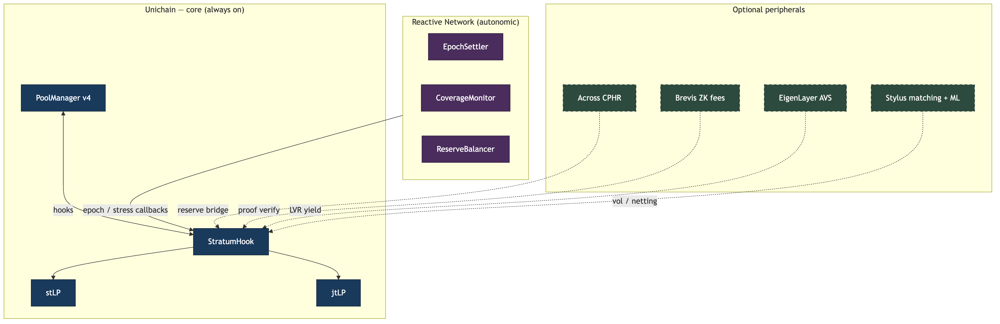
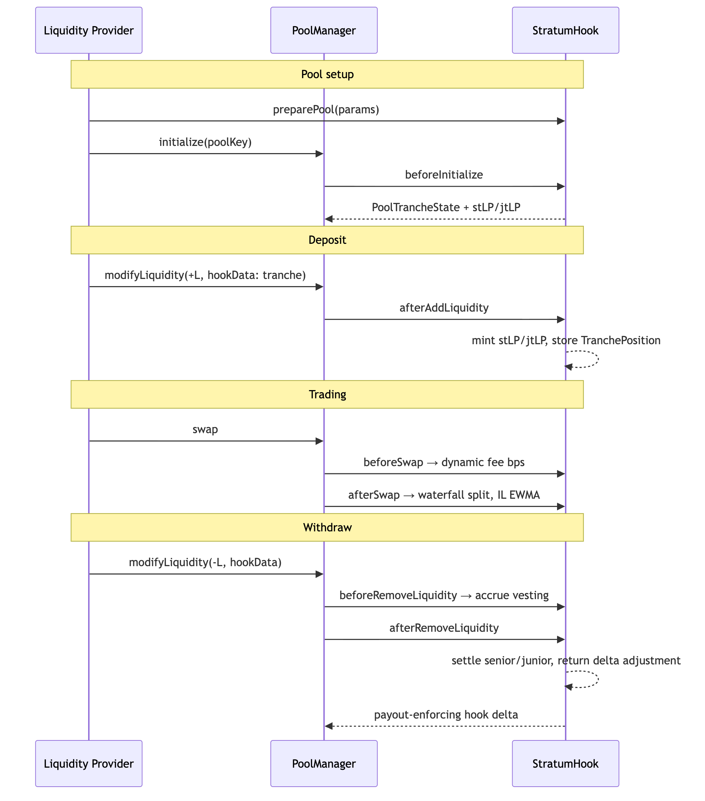
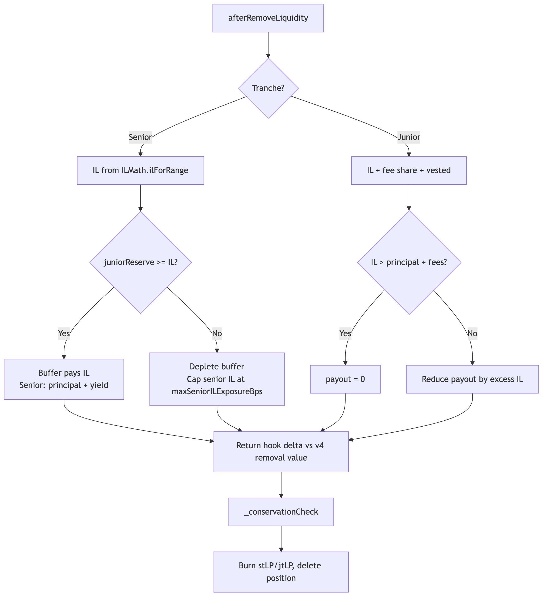
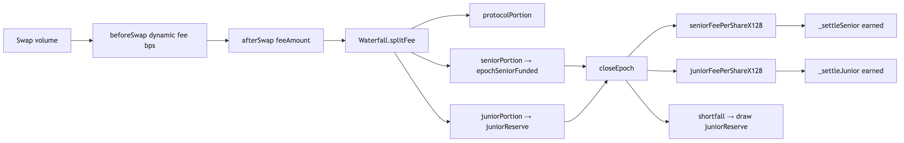
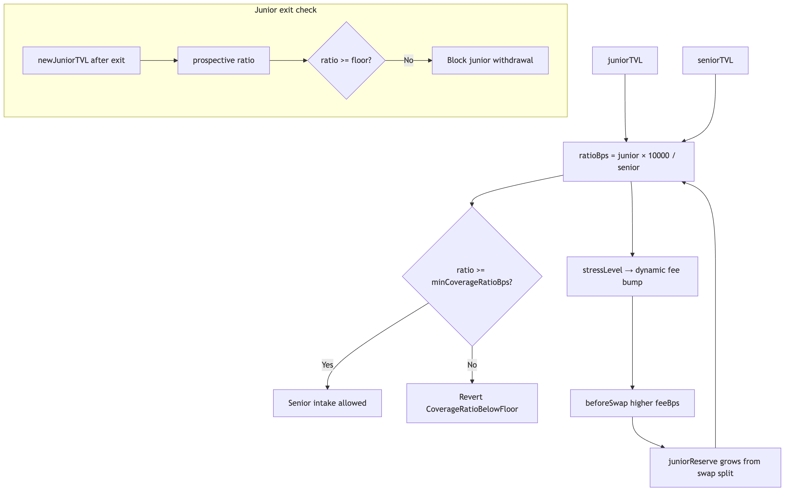
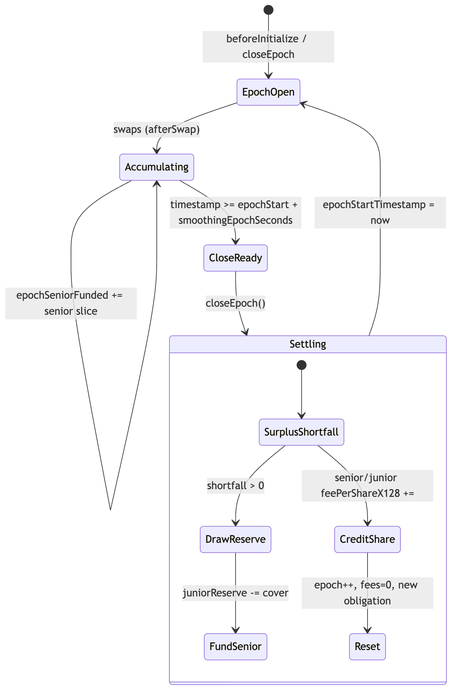
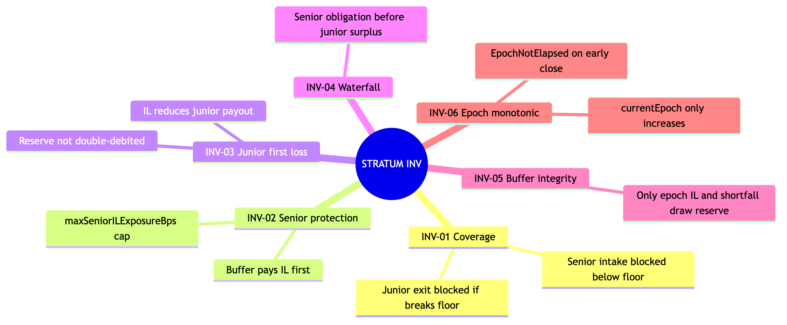

# STRATUM documentation index

Start with **PROPOSAL → PRD → ARCHITECTURE → DESIGN**. Visuals are under [diagrams/](diagrams/).

## Product & build

| File | Description |
|------|-------------|
| [PROPOSAL.md](PROPOSAL.md) | Hackathon pitch |
| [PRD.md](PRD.md) | Product requirements |
| [ARCHITECTURE.md](ARCHITECTURE.md) | Layers, integrations, **full diagram index** |
| [DESIGN.md](DESIGN.md) | Contract behavior (authoritative) |
| [REQUIREMENTS.md](REQUIREMENTS.md) | FR / NFR / INV |
| [PLAN.md](PLAN.md) | Phased delivery |
| [DEPLOYMENT.md](DEPLOYMENT.md) | Unichain Sepolia |
| [AIDLC.md](AIDLC.md) | Agent workflows |

## Security

Public policy: [../SECURITY.md](../SECURITY.md).

Internal audit files (`AUDIT.md`, `AUDIT_GAPS.md`, `AUDIT_FIXES.md`) are **not in git**. Store them under `security/private/` locally (see [../security/README.example](../security/README.example)).

## Code map

| File | Description |
|------|-------------|
| [CODEBASE_GRAPH.md](CODEBASE_GRAPH.md) | graphify analysis of `src/` |
| [diagrams/README.md](diagrams/README.md) | Mermaid + draw.io tooling |

## Figure gallery (rendered)

  

| Topic | PNG |
|-------|-----|
| Hook lifecycle |  |
| Settlement |  |
| Fee waterfall |  |
| Coverage ratio |  |
| Epoch lifecycle |  |
| Invariants |  |

Re-render all figures: `./scripts/render-diagrams.sh` from the repo root.
